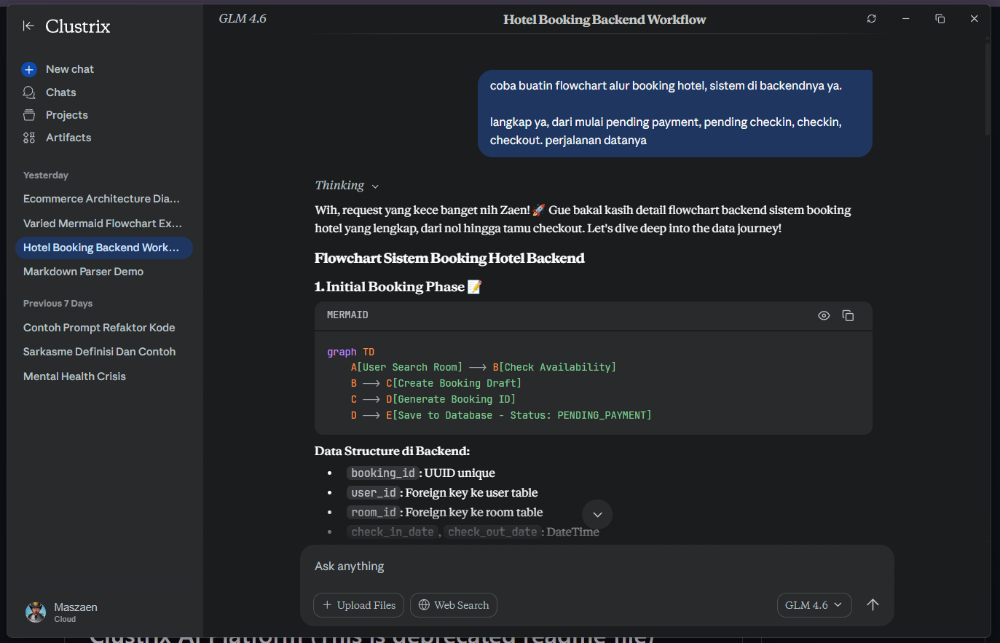
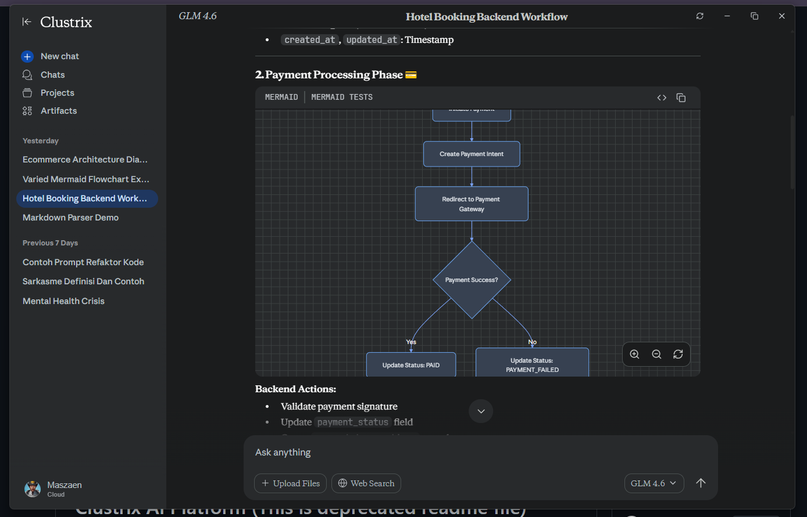
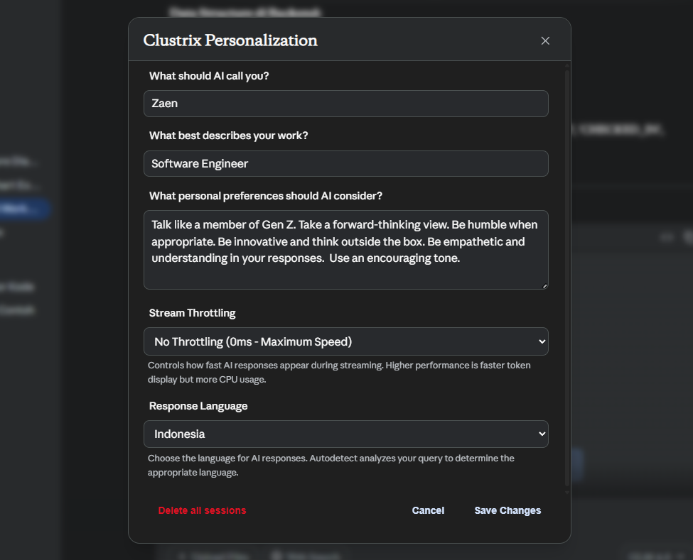
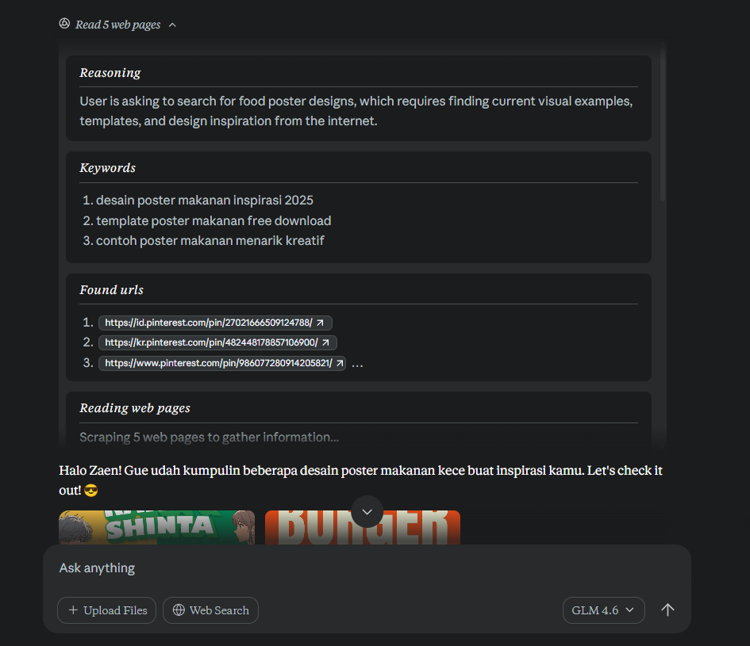
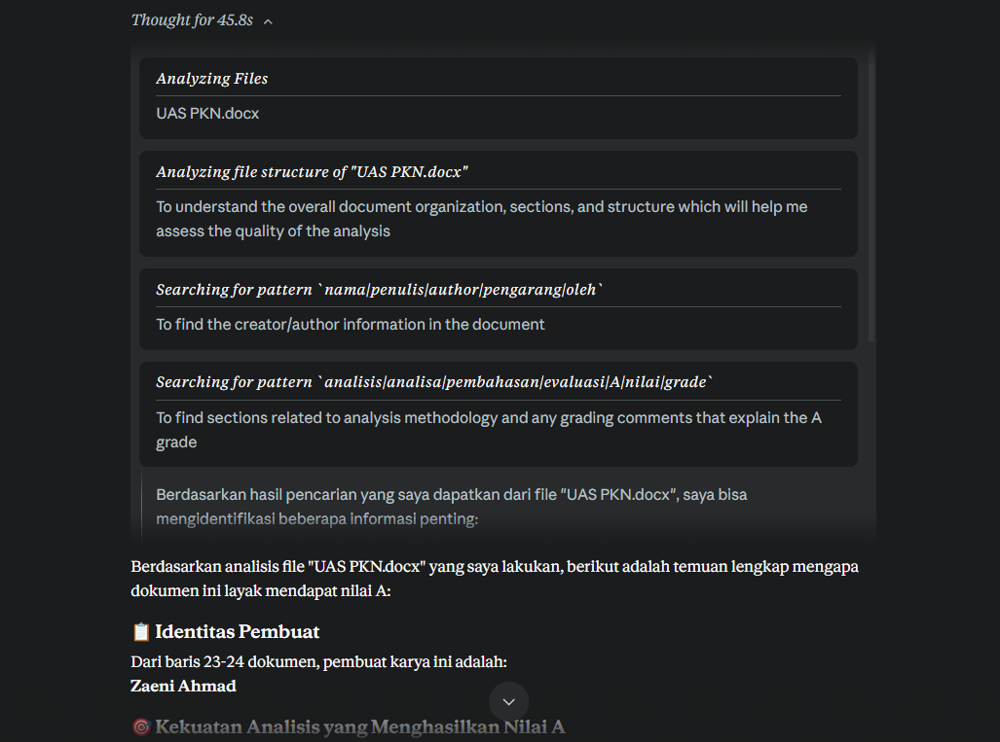
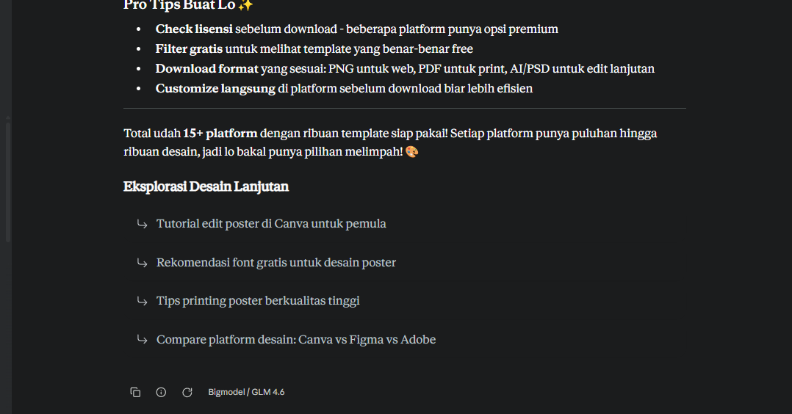
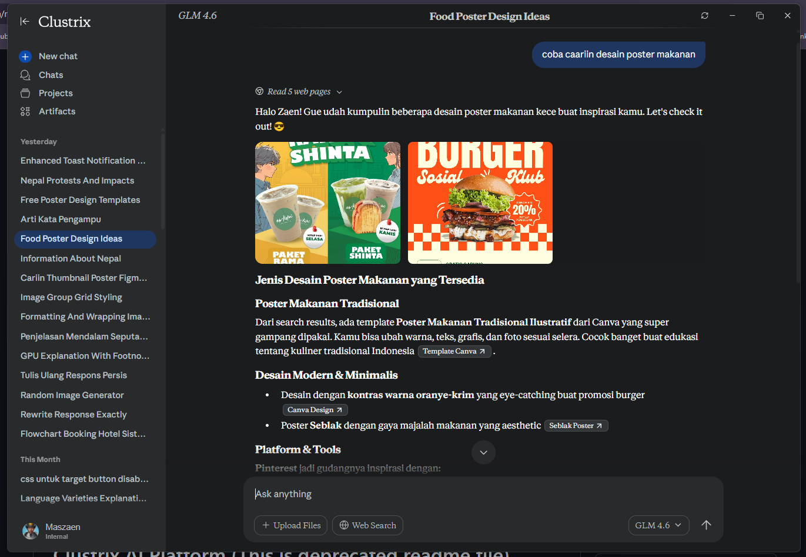
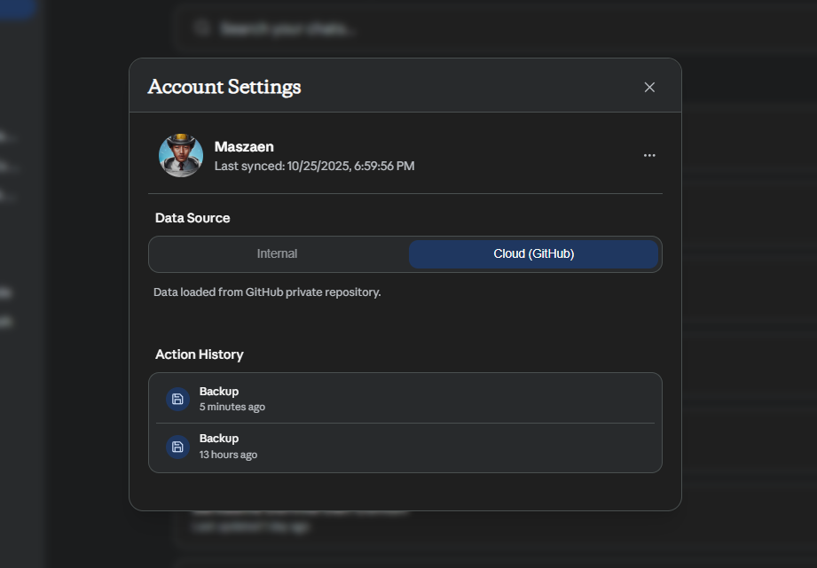
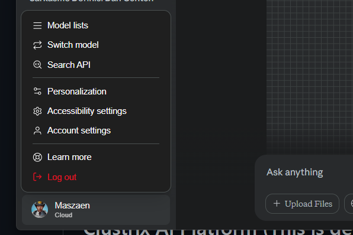
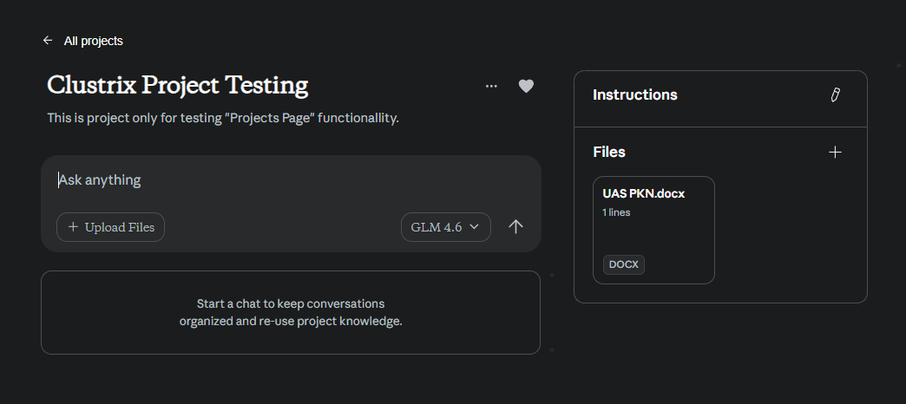

# Clustrix - Enterprise Grade AI Platform

<div align="center">


**Platform AI desktop berbasis Electron dengan kemampuan multi-agent orchestration, advanced markdown parsing, dan integrasi mendalam dengan berbagai AI providers**

[Quick Start](#-quick-start) • [Features](#-fitur-utama) • [Documentation](#-dokumentasi) • [Architecture](#-arsitektur)

</div>

---

## 📖 Tentang Clustrix

**Clustrix** adalah platform AI desktop yang dirancang untuk power-user yang membutuhkan kontrol penuh atas model AI, kemampuan reasoning yang mendalam, dan integrasi mulus dengan workflow pengembangan. Dibangun dengan Electron dan LangChain, Clustrix menyediakan pengalaman chat AI yang kaya fitur dengan dukungan multi-provider, file processing, web search, dan banyak lagi.

<div align="center">
  
  
</div>

<p align="center"><i>Advanced markdown rendering dengan syntax highlighting dan Mermaid diagram support</i></p>

### Mengapa Clustrix?

- 🎯 **Multi-Provider Support**: Gunakan OpenRouter, Groq, Gemini, Z AI, atau custom endpoints
- 🤖 **AI Orchestration**: Multi-agent system dengan RE+ACT reasoning engine
- 📁 **File Intelligence**: Upload dan analisis DOCX, Excel, CSV, dan format lainnya
- 🔍 **Dual Search Engine**: Web search (SerpAPI) dan local desktop search tanpa internet
- 🎨 **Enterprise-Grade Parser**: Markdown parser yang powerful dengan MathJax dan syntax highlighting
- 💾 **Data Management**: SQLite database dengan GitHub sync/backup integration
- 🔒 **Privacy-First**: Semua data disimpan lokal dengan kontrol penuh

---

## 🎯 Fitur Utama

### 🤖 Multi-Agent AI Orchestration
- **Dynamic Research Agent**: Sistem multi-agent yang merencanakan, mencari, dan mensintesis informasi otomatis
- **RE+ACT Reasoning Engine**: Agent dengan kemampuan berpikir dan bertindak (Reasoning + Action) untuk tugas kompleks
- **Thinking Mode**: UI real-time yang menampilkan proses reasoning AI dengan indikator visual
- **Memory & Context**: Vector store untuk konteks percakapan persisten dengan embeddings

### 🔧 Multi-Provider AI Support
- **OpenRouter**: Akses ke ratusan model AI (free & paid)
- **Groq**: Inferensi super cepat dengan model Llama dan Mixtral
- **Gemini**: Model Google dengan multimodal capabilities
- **Z AI**: Platform AI Indonesia
- **Custom**: Endpoint OpenAI-compatible lainnya
- **Per-Provider Config**: API key dan endpoint terpisah untuk setiap provider
- **Model Switching**: Ganti model real-time tanpa restart

<div align="center">
  
</div>

<p align="center"><i>UI Personalization dengan kontrol penuh atas model dan provider</i></p>

### 📁 File Processing & Analysis
- **Multi-Format Support**: DOCX (Mammoth), XLSX/XLS (native), CSV, TXT, MD, JSON
- **Intelligent Summarization**: Ringkasan otomatis untuk file >1500 tokens
- **Project Context**: Analisis struktur proyek untuk respons akurat
- **Drag & Drop**: Upload mudah dengan preview dan parsing otomatis

### 🔍 Advanced Search
- **Web Search**: Integrasi SerpAPI dan Google Custom Search Engine
- **Desktop Search**: Indexing lokal dengan TF-IDF vectorization tanpa internet
- **Semantic Search**: Pencarian berbasis makna untuk file discovery
- **Multi-Query**: Parallel search untuk efisiensi maksimal

<div align="center">
  
  
</div>

<p align="center"><i>Web search integration dan research agent dengan multi-query capabilities</i></p>

<div align="center">
  
</div>

<p align="center"><i>Local desktop search dengan semantic understanding</i></p>

### 🎨 Modern UI/UX
- **Real-time Streaming**: Token streaming dengan typing indicators
- **Markdown Excellence**: Parser enterprise-grade dengan dukungan nested blockquotes, tables, dan codeblocks
- **MathJax Integration**: Rendering formula matematika dan LaTeX
- **Syntax Highlighting**: Prism.js untuk 200+ bahasa pemrograman
- **Multi-Session**: Switch antar percakapan dengan session management
- **Continue Placeholder**: Auto-handling untuk respons terputus

<div align="center">
  
  
</div>

<p align="center"><i>Smart prompt recommendations dan image search capabilities</i></p>

### 💾 Data & Sync
- **SQLite Database**: Database lokal untuk performa tinggi
- **GitHub Integration**: Sync dan backup otomatis ke GitHub
- **Smart Backup**: Timestamped backups dengan conflict resolution
- **Migration Tools**: JSON to SQLite migrator untuk legacy data

<div align="center">
  
  
</div>

<p align="center"><i>Account settings, data source management, dan comprehensive settings modal</i></p>

### 🛠️ Developer Features
- **Comprehensive Logging**: Debug mode dengan contextual logging
- **Session Management**: Multi-session dengan persistence
- **Message Optimization**: Token usage optimization
- **IPC Bridge**: Secure communication antara main dan renderer process
- **Testing Suite**: Unit, integration, dan E2E tests dengan Jest

<div align="center">
  
</div>

<p align="center"><i>Project management dengan detail view untuk organized workflow</i></p>

---

## 🚀 Quick Starts

### Instalasi untuk End-Users (Recommended)

**Download Release Version:**

1. Kunjungi [Releases Page](https://github.com/maszaen/clustrix-ai-platform/releases)
2. Download versi terbaru untuk OS Anda:
   - **Windows**: `Clustrix-Setup-34.6.9.exe`
   - **macOS**: `Clustrix-34.6.9.dmg`
   - **Linux**: `Clustrix-34.6.9.AppImage`
3. Install aplikasi:
   - **Windows**: Jalankan installer dan ikuti wizard instalasi
   - **macOS**: Buka DMG file dan drag Clustrix ke Applications folder
   - **Linux**: Berikan permission execute (`chmod +x Clustrix-*.AppImage`) dan jalankan
4. Buka aplikasi dan mulai setup API keys

> **Note**: Tidak perlu Node.js atau tools development untuk menggunakan release version!

---

### Instalasi untuk Developers

**Prasyarat:**
- **Node.js** ≥ 18.0.0
- **npm**, **yarn**, atau **pnpm**
- OS: Windows 10+, macOS 10.15+, Linux (Ubuntu 18.04+)

**Setup Development:**

```bash
# Clone repository
git clone https://github.com/maszaen/clustrix-ai-platform.git
cd clustrix-ai-platform

# Install dependencies
npm install

# Jalankan development mode
npm run dev

# Build untuk production
npm run make
```

### Konfigurasi Awal

1. Jalankan aplikasi
2. Buka **Personalization → Switch Model**
3. Pilih **Provider** (OpenRouter, Groq, Gemini, Z AI, atau Custom)
4. Masukkan **API Key** dan **Base URL**
5. Pilih **Model** dari daftar
6. Mulai chat!

### Environment Variables (Opsional)

```bash
# Debug mode
CLUSTRIX_DEBUG=true

# Custom API keys
OPENROUTER_API_KEY=your_key
GROQ_API_KEY=your_key
GOOGLE_API_KEY=your_key
SERPAPI_KEY=your_key
```

---

## 📖 How to Use Clustrix

### Core Concept: Bring Your Own Key (BYOK)

Clustrix AI beroperasi dengan model **Bring Your Own Key (BYOK)**. Ini berarti Anda menghubungkan API key Anda sendiri dari berbagai penyedia layanan AI. Data Anda dikirim langsung dari komputer Anda ke layanan yang Anda pilih. Kami tidak melihat, menyimpan, atau memproses percakapan Anda.

**Keuntungan BYOK:**
- 🔒 **Privacy**: Percakapan tetap privat antara Anda dan AI provider
- 🔄 **Flexibility**: Gunakan model apapun dari provider yang didukung
- 💰 **Cost Control**: Bayar langsung ke provider, no subscriptions

### Setting Up Your First API Key

1. Buka **Settings → Switch Model** (atau **Personalization → Switch Model**)
2. Pilih platform dari dropdown (OpenRouter, OpenAI, Anthropic, dll)
3. Dapatkan API key dari provider:
   - [OpenRouter](https://openrouter.ai/keys) - Akses ratusan model dengan satu key
   - [OpenAI](https://platform.openai.com/api-keys) - GPT models
   - [Anthropic](https://console.anthropic.com/settings/keys) - Claude models
   - [Groq](https://console.groq.com/keys) - Ultra-fast inference
4. Masukkan API key di field **"API Key"**
5. Klik **Save settings** - aplikasi akan validate dan load available models

**Custom Providers:**
Untuk menambahkan provider custom atau model baru:
- Ketik nama baru di field "Platform" untuk create provider baru
- Tambahkan Base URL, API Key, dan model ID
- Berguna untuk custom endpoints atau self-hosted models

### Key Features Overview

#### 🔄 Model Switching
Ganti AI model untuk session aktif melalui **Settings → Switch Model**. Perubahan berlaku real-time tanpa restart.

#### 🔍 Web Search
Enable real-time web search:
1. Buka **Settings → Search API**
2. Tambahkan Google Search API key atau SerpAPI key
3. Web search akan tersedia di chat dengan hasil real-time

#### 📁 File Uploads
Drag & drop files ke chat untuk AI analysis:
- **Supported**: DOCX, XLSX, CSV, PDF, TXT, MD, JSON
- **Auto-processing**: Files diparsing otomatis berdasarkan format
- **Context integration**: Content file digunakan sebagai context reasoning

#### 📂 Projects
Organisir chats dan files ke dalam projects:
- Better context management
- Grouped conversations
- Project-specific file uploads

#### ☁️ Cloud Sync (Optional)
Sync data across devices:
1. Login dengan GitHub di **Settings → Account settings**
2. Data disimpan di private repository GitHub Anda
3. Fully optional dan bisa disabled kapan saja
4. Anda tetap kontrol penuh atas data

---

## ⌨️ Keyboard Shortcuts

### General Shortcuts

| Shortcut | Action |
|----------|--------|
| `Ctrl + N` | Create new session |
| `Ctrl + Tab` | Switch to next session |
| `Ctrl + Shift + Tab` | Switch to previous session |
| `Ctrl + R` | Reload application |
| `Esc` | Close any open modal/dialog |
| `/` | Focus input field or search bar |

### Message Input Shortcuts

| Shortcut | Action |
|----------|--------|
| `Enter` | Send message (regular chat) |
| `Shift + Enter` | Create new line in input |
| `Ctrl + Enter` | Send message (project sessions) |

### Navigation Tips
- Use keyboard shortcuts untuk faster workflow
- `Esc` key untuk quick dismiss modals
- Tab navigation works across all input fields

---

## 📋 Dokumentasi

### Konfigurasi Model

**Personalization → Switch Model** menyediakan kontrol penuh atas:

#### Per-Provider Settings
- **Base URL**: Endpoint API spesifik provider
- **API Key**: Kunci akses (disimpan plain text untuk debugging)
- **Model List**: Daftar model dengan label dan catatan kustom

#### Model Management
```javascript
// Format konfigurasi model
{
  "id": "anthropic/claude-3-haiku",
  "label": "Claude 3 Haiku",
  "note": "Fast and efficient for general tasks"
}
```

#### Title Generator
- **Default**: Gunakan model chat aktif
- **Custom**: Pilih model spesifik (lebih murah/cepat) untuk pembuatan judul

### Provider Base URLs

| Provider | Base URL | Catatan |
|----------|----------|---------|
| OpenRouter | `https://openrouter.ai/api/v1` | Ratusan model tersedia |
| Groq | `https://api.groq.com/openai/v1` | Inferensi super cepat |
| Gemini | `https://generativelanguage.googleapis.com/v1beta` | Multimodal capabilities |
| Z AI | `https://api.z.ai/api/paas/v4/` | Platform AI Indonesia |
| Custom | Your endpoint | OpenAI-compatible format |

### File Processing

#### Supported Formats
- **DOCX**: Text extraction dengan Mammoth
- **XLSX/XLS**: Sheet parsing dan data extraction
- **CSV**: Auto-detection delimiter dan encoding
- **TXT/MD**: Full text processing
- **JSON**: Structured data parsing

#### Workflow
1. **Upload**: Drag & drop atau file dialog
2. **Preview**: Syntax highlighting otomatis
3. **Processing**: Parsing berdasarkan format
4. **Integration**: Context disuntikkan ke AI reasoning
5. **Storage**: Persistent dalam session

### Search Engines

#### Web Search (SerpAPI/Google CSE)
```javascript
// Konfigurasi SerpAPI
{
  "provider": "serpapi",
  "apiKey": "your_key",
  "maxResults": 5
}

// Konfigurasi Google CSE
{
  "provider": "google",
  "apiKey": "your_key",
  "cseId": "your_cse_id"
}
```

#### Local Desktop Search
- **TF-IDF Vectorization**: Semantic search lokal
- **No API Costs**: Semua processing offline
- **Instant Results**: Sub-second response time
- **Incremental Indexing**: Update otomatis saat file berubah

### UI Features

#### Streaming Interface
- **Real-time Streaming**: Respons muncul bertahap
- **Thinking Indicators**: Visual feedback saat AI processing
- **Continue Placeholder**: Auto-handling respons terputus (auto-hide 5 detik)

#### Message Actions
- **Copy**: Copy respons ke clipboard
- **Regenerate**: Generate ulang respons dengan parameter sama
- **Continue**: Lanjutkan respons yang terputus

#### Markdown Parser
Parser enterprise-grade yang menangani:
- ✅ Nested blockquotes dengan benar
- ✅ Codeblocks dalam lists dengan indentasi tepat
- ✅ Tables dengan row continuation
- ✅ MathJax inline dan block
- ✅ Syntax highlighting 200+ bahasa
- ✅ Mermaid diagrams

---

## 🏗️ Arsitektur

### Struktur Aplikasi

```
Clustrix-AI-Platform/
├── main.js                      # Electron main process
├── preload.js                   # IPC bridge & security layer
├── renderer/
│   ├── renderer.js              # UI logic & state management
│   ├── index.html               # Main UI template
│   ├── style.css                # Styling & themes
│   ├── md.js                    # Markdown parser
│   └── core/
│       └── title-gen.js         # Title generation logic
├── backend/
│   ├── langchain-service.js     # LangChain orchestration
│   ├── langchain-agents.js      # Multi-agent system
│   ├── reasoning-action-agent.js # RE+ACT engine
│   ├── web-search.js            # Web search integration
│   ├── desktop-search-engine.js # Local search engine
│   ├── file-summarizer.js       # File processing
│   ├── local-embedding-engine.js # TF-IDF embeddings
│   ├── database-manager.js      # SQLite manager
│   ├── github-storage-service.js # GitHub sync
│   ├── smart-backup-service.js  # Backup automation
│   └── sync-manager.js          # Sync orchestration
├── utils/
│   ├── logger.js                # Logging system
│   └── message-optimizer.js     # Token optimization
├── local_modules/
│   ├── custom/                  # Custom modules
│   ├── custom-formatter/        # Markdown formatter
│   ├── prism/                   # Syntax highlighting
│   └── xlsx/                    # Excel parser
└── public/
    ├── images/                  # Assets
    └── fonts/                   # Custom fonts
```

### Data Flow

```
User Input
    ↓
IPC Bridge (preload.js)
    ↓
Main Process (main.js)
    ↓
Backend Services
    ├─→ LangChain Service → AI Providers
    ├─→ File Processor → Context Integration
    ├─→ Web/Local Search → Results Synthesis
    └─→ Database Manager → Persistent Storage
    ↓
Response Streaming
    ↓
IPC Events → Renderer Process
    ↓
UI Updates (renderer.js)
    ├─→ Markdown Parser → Rendered HTML
    ├─→ Syntax Highlighting → Code Blocks
    └─→ MathJax → Math Formulas
```

### Security Model

- **Context Isolation**: Renderer tidak akses langsung Node.js APIs
- **IPC Validation**: Semua komunikasi main-renderer divalidasi
- **File Sandboxing**: File operations terbatas pada allowed directories
- **API Key Storage**: Plain text (development) dengan rencana encryption (production)

---

## 🔧 Troubleshooting

### API Key Issues

#### Invalid API Key Error
**Penyebab**: Key tidak valid atau salah format  
**Solusi**: 
- Verifikasi key di dashboard provider
- Pastikan tidak ada spasi atau karakter extra
- Cek apakah menggunakan correct key type (secret key vs organization key)

#### Key Not Recognized
**Penyebab**: Format key berbeda per provider  
**Solusi**:
- OpenAI: Gunakan "secret key" bukan organization key
- OpenRouter: Pastikan key dimulai dengan `sk-or-v1-`
- Anthropic: Key format `sk-ant-api03-`

#### Rate Limited
**Penyebab**: Melebihi quota atau rate limits provider  
**Solusi**:
- Cek usage dashboard di provider website
- Tunggu beberapa saat sebelum retry
- Upgrade plan jika perlu quota lebih besar

#### Cannot Save Settings
**Penyebab**: Permission issue atau corrupted config  
**Solusi**:
- Restart Clustrix AI
- Cek write permissions di application data directory
- Windows: `%APPDATA%\Clustrix`
- macOS: `~/Library/Application Support/Clustrix`
- Linux: `~/.config/Clustrix`

---

### Chat and Connection Issues

#### No Response from AI
**Penyebab**: Connection, API key, atau quota issues  
**Solusi**:
- Verifikasi internet connection active
- Cek API key valid dan has remaining credits
- Try switching ke model atau provider berbeda
- Periksa provider status page untuk outages

#### Connection Timeout
**Penyebab**: Provider experiencing high load  
**Solusi**:
- Tunggu beberapa saat dan retry
- Switch ke faster model (Groq untuk speed)
- Reduce prompt complexity jika terlalu panjang

#### Incomplete Responses
**Penyebab**: Model limits atau interrupted stream  
**Solusi**:
- Gunakan tombol **Continue** yang muncul otomatis
- Break question into smaller parts
- Increase max tokens di model settings

#### "Response Interrupted" Banner
**Penyebab**: Stream ended unexpectedly  
**Solusi**: 
- Klik **Continue** untuk melanjutkan response
- Switch model jika problem persists
- Close banner jika response sudah cukup

#### Web Search Not Working
**Penyebab**: Search API key missing atau invalid  
**Solusi**:
- Add valid Google Search API key or SerpAPI key
- Go to **Settings → Search API**
- Verify API has remaining quota
- Check search API billing status

---

### File Upload Issues

#### File Not Uploading
**Penyebab**: File size atau format issues  
**Solusi**:
- Check file size reasonable (usually < 50MB)
- Supported formats: DOCX, XLSX, CSV, PDF, TXT, MD, JSON
- Try compressing file jika terlalu besar

#### File Upload Fails
**Penyebab**: Memory atau processing issues  
**Solusi**:
- Upload smaller test file first
- Restart Clustrix AI
- Check available disk space

#### File Content Not Recognized
**Penyebab**: Corrupted atau encrypted file  
**Solusi**:
- Verify file is not corrupted
- Remove password protection from files
- Convert to supported format
- Try opening file in native app first

---

### Performance Issues

#### App Runs Slowly
**Penyebab**: Memory usage atau large data  
**Solusi**:
- Close other memory-intensive applications
- Clear old chat history
- Archive completed sessions
- Reduce simultaneous open projects

#### High Memory Usage
**Penyebab**: Large files atau long conversations  
**Solusi**:
- Break work into smaller sessions
- Remove large file uploads when done
- Clear cached data periodically
- Restart app untuk free memory

#### UI Freezes
**Penyebab**: Heavy processing operation  
**Solusi**:
- Wait a few seconds for processing
- Check if AI is reasoning (thinking indicator)
- Force quit and restart if persists (Ctrl+Q or Cmd+Q)

---

### Sync and Data Issues

#### Cloud Sync Not Working
**Penyebab**: Authentication atau connection issues  
**Solusi**:
- Verify logged in with GitHub (**Settings → Account settings**)
- Check internet connection active
- Re-authenticate with GitHub
- Check GitHub API rate limits

#### Data Not Syncing
**Penyebab**: Auto-sync disabled atau conflicts  
**Solusi**:
- Enable auto-sync in settings
- Trigger manual sync: Click **Sync Now**
- Resolve merge conflicts if prompted
- Check GitHub repository access

#### Lost Data
**Penyebab**: Sync conflict atau local corruption  
**Solusi**:
- Check local backups in app data directory
- Restore from timestamped backups
- Pull latest from GitHub if synced
- Export data regularly as precaution

#### Conflict Resolution
**Penyebab**: Changes made on multiple devices  
**Solusi**:
- Clustrix AI auto-merges when possible
- Most recent version kept for unresolvable conflicts
- Review merged data after conflict resolution
- Use manual sync untuk better control

---

### Installation Issues

#### Windows Installation Blocked
**Penyebab**: SmartScreen protection  
**Solusi**:
- Click "More info" → "Run anyway"
- Application is safe but not code-signed yet
- Check SHA hash matches release notes

#### macOS "Cannot Open" Error
**Penyebab**: Gatekeeper security  
**Solusi**:
- Right-click app → Open (first time)
- Or: System Preferences → Security → Allow
- Application is safe but not notarized yet

#### Linux Permission Denied
**Penyebab**: Execute permission not set  
**Solusi**:
```bash
chmod +x Clustrix-*.AppImage
./Clustrix-*.AppImage
```

---

### Still Need Help?

Jika issue tidak covered di sini:

1. **Check GitHub Issues**: [github.com/maszaen/clustrix-ai-platform/issues](https://github.com/maszaen/clustrix-ai-platform/issues)
2. **Open New Issue**: Include:
   - What you were trying to do
   - Exact error message (screenshot if possible)
   - OS and Clustrix version
   - Steps to reproduce
3. **Community Support**: Join discussions di GitHub
4. **Email**: exqeon@gmail.com untuk private issues

The community dan maintainers ready to help!

### Debug Mode

```bash
# Enable debug logging
CLUSTRIX_DEBUG=true npm run dev

# Check logs (Windows)
type %APPDATA%\Clustrix\logs\app.log

# Check logs (macOS/Linux)
tail -f ~/Library/Application\ Support/Clustrix/logs/app.log
```

### Reset Configuration

```bash
# Windows
del %APPDATA%\Clustrix\ai-model.conf.json
del %APPDATA%\Clustrix\chat_data.db

# macOS/Linux
rm ~/Library/Application\ Support/Clustrix/ai-model.conf.json
rm ~/Library/Application\ Support/Clustrix/chat_data.db
```

Atau gunakan tombol **Reset Defaults** di modal Switch Model.

---

## 🧪 Testing

```bash
# Run all tests
npm test

# Run tests in watch mode
npm run test:watch

# Run specific test suite
npm test -- file-summarizer.test.js
```

### Test Coverage
- ✅ Unit tests untuk backend services
- ✅ Integration tests untuk IPC communication
- ⏳ E2E tests (in progress)

---

## 🤝 Contributing

Kontribusi sangat diterima! Untuk berkontribusi:

1. Fork repository
2. Create feature branch (`git checkout -b feature/AmazingFeature`)
3. Commit changes (`git commit -m 'Add AmazingFeature'`)
4. Push to branch (`git push origin feature/AmazingFeature`)
5. Open Pull Request

### Development Guidelines

- Follow existing code style dan patterns
- Add tests untuk fitur baru
- Update dokumentasi jika diperlukan
- Gunakan conventional commits
- Test thoroughly sebelum submit PR

---

## 📄 License

Distributed under the MIT License. See `LICENSE` file for more information.

---

## 🙏 Acknowledgments

### Core Technologies
- **Electron** - Desktop application framework
- **LangChain** - AI orchestration dan agent framework
- **OpenRouter** - Multi-model AI platform
- **Better SQLite3** - High-performance database

### Libraries & Tools
- **Mammoth** - DOCX processing
- **SerpAPI** - Web search API
- **MathJax** - Mathematical rendering
- **Prism.js** - Syntax highlighting
- **Cheerio** - HTML/XML parsing
- **UUID** - Unique identifier generation

### Acknowledgments
Special thanks ke semua contributors dan open-source community yang membuat Clustrix mungkin terwujud.

---

<div align="center">

**Built with ❤️ by [Maszaen Corporation](https://github.com/maszaen)**

*For the AI-powered future*

</div>